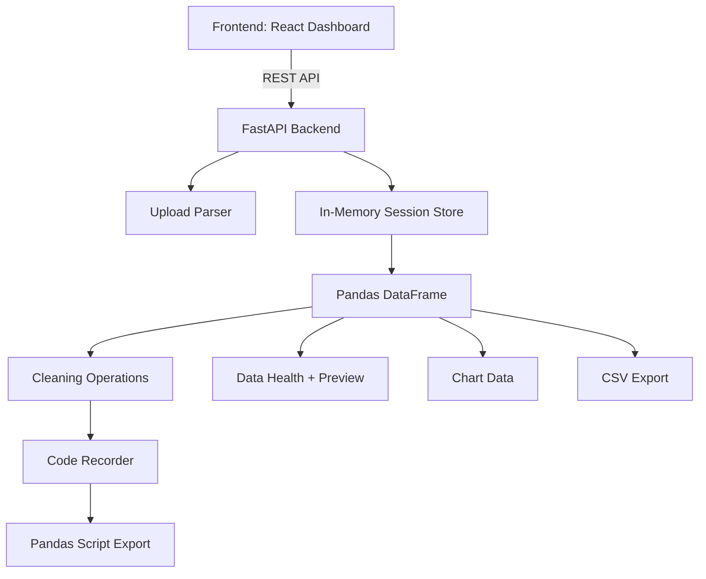
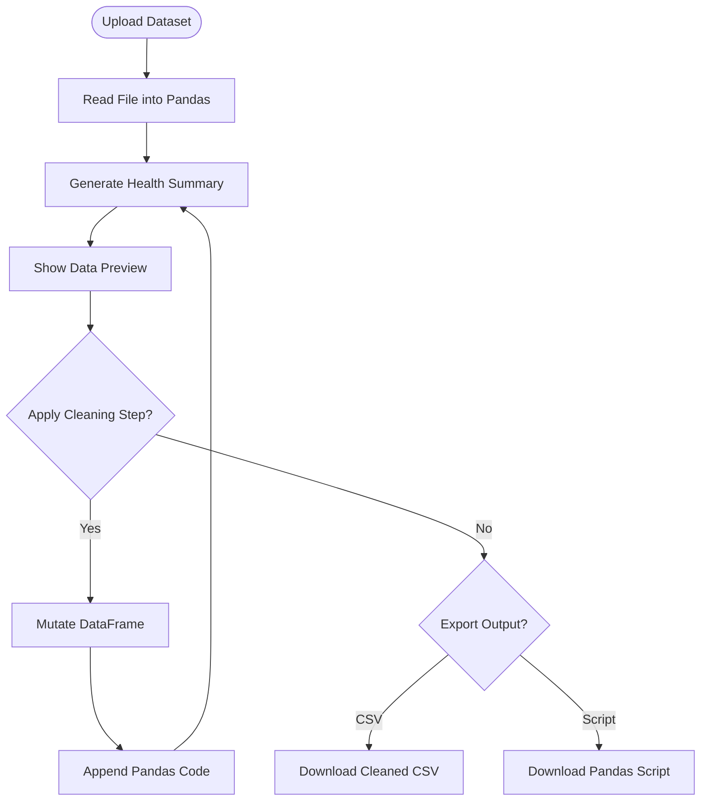

# Data Prep Studio
### Interactive Data Cleaning, Profiling & Pandas Pipeline Generation

Clean tabular datasets through a local web dashboard, inspect data quality, apply common preparation steps, generate quick visualizations, and export both the cleaned CSV and the equivalent Pandas script.

[Overview](#overview) • [Features](#features) • [Architecture](#architecture) • [Installation](#installation) • [API Docs](#api-documentation) • [Workflow](#data-prep-workflow)

---

## Table of Contents

- [Overview](#overview)
- [Features](#features)
- [Architecture](#architecture)
- [Project Structure](#project-structure)
- [Installation](#installation)
- [Environment Variables](#environment-variables)
- [API Documentation](#api-documentation)
- [Frontend Experience](#frontend-experience)
- [Data Prep Workflow](#data-prep-workflow)
- [Security](#security)
- [Performance](#performance)
- [Development Notes](#development-notes)
- [Verified Workflow](#verified-workflow)
- [Roadmap](#roadmap)
- [License](#license)

---

## Overview

Data preparation is one of the most repetitive parts of analytics and machine learning work. Before a dataset can be analyzed, modeled, or shared, users often need to inspect missing values, clean inconsistent text, drop duplicates, convert types, and document every transformation.

Data Prep Studio provides a focused local interface for that workflow. Users upload a dataset, review health metrics, apply transformations through the UI, preview the result, and download a reproducible Pandas script that mirrors the operations performed in the dashboard.

### Why this project exists

- Data cleaning should be quick to explore and easy to reproduce.
- Manual spreadsheet edits are hard to audit and replay.
- Analysts and developers need a bridge between interactive cleanup and production-ready code.

### Target Users

| User Type | Use Case |
| --- | --- |
| Data Analysts | Clean and inspect CSV/Excel datasets before analysis |
| ML Practitioners | Prepare raw datasets before feature engineering or modeling |
| Operations Teams | Standardize recurring spreadsheet cleanup tasks |
| Developers | Generate a Pandas baseline pipeline from UI-driven actions |

### Key Benefits

- Faster cleanup through a focused visual workflow.
- Reproducible output through generated Pandas code.
- Immediate dataset health feedback after every operation.
- Local-first runtime for simple development and demos.
- Export-ready CSV output for downstream tools.

---

## Features

### Dataset Upload

- Upload CSV, TSV, Excel, JSON, and Parquet files.
- Create an in-memory cleaning session per uploaded file.
- Preview the dataset immediately after upload.

### Data Health Summary

- Row and column counts.
- Missing value tracking.
- Duplicate row detection.
- Inferred column types.
- Column-level quality indicators.

### Cleaning Operations

- Impute missing values.
- Sanitize numeric-looking text values.
- Cast columns to target types.
- Trim whitespace.
- Drop duplicate rows.
- Drop columns.
- Rename columns.

### Preview Grid

- Inspect the current dataframe state.
- Review the first rows after transformations.
- Select columns for cleanup and visualization.

### Auto Visualization

- Generate chart-ready summaries for selected columns.
- Supports categorical bar charts.
- Supports numeric histograms.
- Supports two-column visualizations where applicable.

### Code Recorder

- Records each user action as Pandas code.
- Exports a replayable `.py` script.
- Keeps UI-driven transformations auditable.

### Export

- Download the cleaned dataset as CSV.
- Download the generated Pandas pipeline as a Python script.

---

## Architecture



> Note: Sessions are currently stored in memory inside the backend process. Restarting the backend clears active sessions.

---

## Project Structure

```text
Data-Prep-Studio/
|
+-- Backend/
|   +-- requirements.txt       # Python dependencies
|   +-- server.py              # FastAPI app, routes, cleaning logic
|
+-- Frontend/
|   +-- public/
|   |   +-- index.html         # React app HTML shell
|   +-- src/
|   |   +-- components/        # Upload, health, grid, cleaning, chart, recorder
|   |   +-- components/ui/     # Shared UI wrappers
|   |   +-- lib/
|   |   |   +-- api.js         # Frontend API client
|   |   +-- pages/
|   |   |   +-- Studion.jsx    # Main studio page
|   |   +-- App.js
|   |   +-- index.js
|   +-- craco.config.js        # CRA/CRACO configuration
|   +-- package.json
|   +-- package-lock.json
|
+-- .gitignore
+-- README.md
```

---

## Installation

### Prerequisites

- Python 3.11 recommended
- Node.js and npm
- Git

Python 3.11 is recommended because some scientific Python dependencies may not install cleanly on newer Python versions.

### 1. Clone the Repository

```bash
git clone https://github.com/ymanoj7745-lgtm/Data-Prep-Studio.git
cd Data-Prep-Studio
```

### 2. Backend Setup

```bash
cd Backend
python -m venv ../.venv311
../.venv311/Scripts/python -m pip install -r requirements.txt
../.venv311/Scripts/python -m uvicorn server:app --host 127.0.0.1 --port 8000
```

On macOS or Linux:

```bash
cd Backend
python -m venv ../.venv311
../.venv311/bin/python -m pip install -r requirements.txt
../.venv311/bin/python -m uvicorn server:app --host 127.0.0.1 --port 8000
```

Backend URL:

```text
http://127.0.0.1:8000
```

Health check:

```text
GET http://127.0.0.1:8000/api/
```

Expected response:

```json
{
  "service": "Data Prep Studio",
  "status": "ok"
}
```

### 3. Frontend Setup

```bash
cd Frontend
npm install --legacy-peer-deps
```

Start the frontend on Windows:

```bash
set REACT_APP_BACKEND_URL=http://127.0.0.1:8000
set WDS_SOCKET_PORT=3000
set BROWSER=none
npm start
```

On macOS or Linux:

```bash
REACT_APP_BACKEND_URL=http://127.0.0.1:8000 \
WDS_SOCKET_PORT=3000 \
BROWSER=none \
npm start
```

Frontend URL:

```text
http://127.0.0.1:3000
```

---

## Environment Variables

### Backend

| Variable | Description | Required |
| --- | --- | --- |
| `MONGO_URL` | MongoDB connection string placeholder from the app template | No for current in-memory workflow |
| `DB_NAME` | Database name placeholder from the app template | No for current in-memory workflow |
| `CORS_ORIGINS` | Comma-separated list of allowed frontend origins | Yes |

Example:

```text
MONGO_URL=mongodb://localhost:27017
DB_NAME=test_database
CORS_ORIGINS=*
```

### Frontend

| Variable | Description | Required |
| --- | --- | --- |
| `REACT_APP_BACKEND_URL` | Backend base URL used by the React app | Yes |
| `WDS_SOCKET_PORT` | Webpack dev server socket port | No |
| `ENABLE_HEALTH_CHECK` | Local template flag | No |

Example:

```text
REACT_APP_BACKEND_URL=http://127.0.0.1:8000
WDS_SOCKET_PORT=3000
ENABLE_HEALTH_CHECK=false
```

> Security callout: Do not commit real `.env` files or secrets to version control.

---

## API Documentation

Interactive FastAPI documentation is available once the backend is running:

```text
http://127.0.0.1:8000/docs
http://127.0.0.1:8000/redoc
```

All routes are prefixed with `/api`.

### GET `/api/`

Health check endpoint.

Response:

```json
{
  "service": "Data Prep Studio",
  "status": "ok"
}
```

---

### POST `/api/sessions/upload`

Upload a supported dataset and create a new in-memory session.

Request:

```text
multipart/form-data
file=<dataset>
```

Response includes:

```json
{
  "session_id": "uuid",
  "filename": "sample.csv",
  "health": {},
  "preview": {},
  "code": []
}
```

---

### GET `/api/sessions/{sid}`

Retrieve the current session state.

Response includes:

```json
{
  "health": {},
  "preview": {},
  "code": []
}
```

---

### POST `/api/sessions/{sid}/impute`

Impute missing values in a column.

Request:

```json
{
  "column": "age",
  "strategy": "mean",
  "value": null
}
```

---

### POST `/api/sessions/{sid}/sanitize`

Sanitize values in a column, commonly used for numeric-looking text.

Request:

```json
{
  "column": "sales"
}
```

---

### POST `/api/sessions/{sid}/cast`

Cast a column to a target type.

Request:

```json
{
  "column": "age",
  "target": "float"
}
```

---

### POST `/api/sessions/{sid}/drop_column`

Drop a column from the current dataframe.

Request:

```json
{
  "column": "unused_column"
}
```

---

### POST `/api/sessions/{sid}/rename_column`

Rename a column.

Request:

```json
{
  "column": "old_name",
  "new_name": "new_name"
}
```

---

### POST `/api/sessions/{sid}/drop_duplicates`

Drop duplicate rows from the current dataframe.

---

### POST `/api/sessions/{sid}/strip_whitespace`

Trim whitespace in a text column.

Request:

```json
{
  "column": "name"
}
```

---

### POST `/api/sessions/{sid}/chart`

Generate chart-ready data for one or two selected columns.

Request:

```json
{
  "columns": ["sales"]
}
```

---

### GET `/api/sessions/{sid}/script`

Download the generated Pandas script.

---

### GET `/api/sessions/{sid}/download_csv`

Download the current cleaned dataframe as CSV.

---

## Frontend Experience

| Area | Description |
| --- | --- |
| Upload Zone | File upload entry point for supported tabular formats |
| Data Health | Dataset-level quality summary |
| Cleaning Wizard | Column selection and transformation controls |
| Data Grid | Preview of the current dataframe |
| Auto Visualization | Quick chart generation from selected columns |
| Code Recorder | Live Pandas script generated from user actions |
| Export Controls | CSV and Python script downloads |

---

## Data Prep Workflow



---

## Security

- Uploaded files are processed by the local backend process.
- Sessions are stored in memory and are not persisted by the current implementation.
- Request payloads are validated with FastAPI and Pydantic models.
- CORS is controlled by the `CORS_ORIGINS` environment variable.
- `.env`, virtual environments, caches, and dependency directories are excluded from Git.

> Security callout: This project is currently optimized for local workflows and demos. Add authentication, upload limits, persistent storage controls, rate limiting, and dependency scanning before exposing it publicly.

---

## Performance

- Pandas and NumPy handle dataframe operations in memory.
- Preview responses are limited for UI responsiveness.
- Scatter plot data is sampled for large datasets.
- The app avoids database round trips for the core local workflow.

Recommended production improvements:

- Add file size and row count limits.
- Move long-running transformations to background jobs.
- Persist sessions in object storage or a database.
- Stream larger downloads where appropriate.

---

## Development Notes

- Use `npm install --legacy-peer-deps` for the current frontend dependency tree.
- Python 3.11 is the recommended backend runtime.
- The current `emergentintegrations==0.2.0` requirement may be unavailable from some package indexes and is not used by the active local data-prep code path.
- Runtime artifacts such as `.venv`, `.venv311`, `node_modules`, `.env`, caches, and local scratch files are ignored.

---

## Verified Workflow

The following flows have been tested locally:

- Backend health check
- Dataset upload
- Session state retrieval
- Missing-value imputation
- Whitespace trimming
- Duplicate-row removal
- Chart data generation
- CSV export
- Pandas script export
- Frontend upload flow
- Frontend dashboard update
- Frontend cleanup controls
- Code recorder update

---

## Roadmap

- Add persistent session storage.
- Add authentication for shared deployments.
- Add richer type inference and validation.
- Add saved cleaning recipes.
- Add batch pipeline execution.
- Add automated tests for API and UI flows.
- Add deployment configuration.

---

## License

No license has been specified yet.
